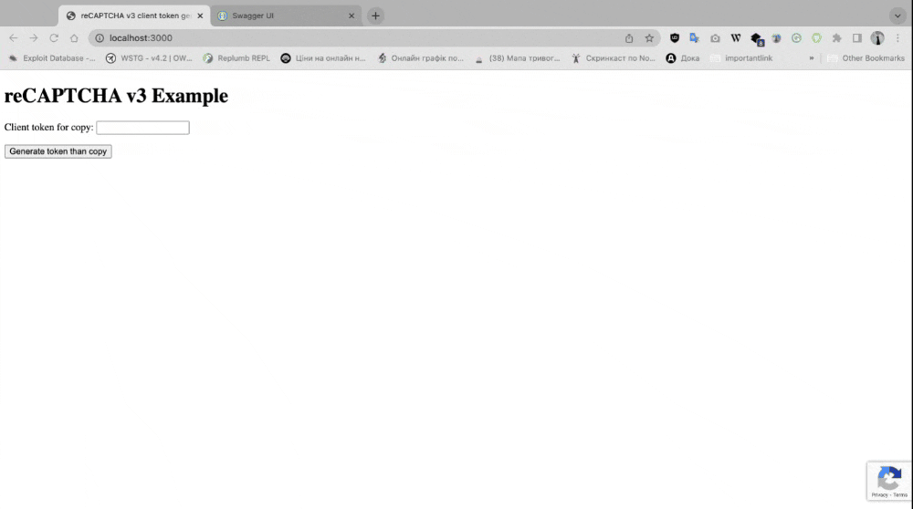

# Replace all secret and site-key

# run app: yarn && yarn start
# swagger url: http://localhost:3000/swagger
# static client reCaptcha token generator: http://localhost:3000/static/ or http://localhost:3000/  :just press "Generate token than copy" and paste in swagger header

